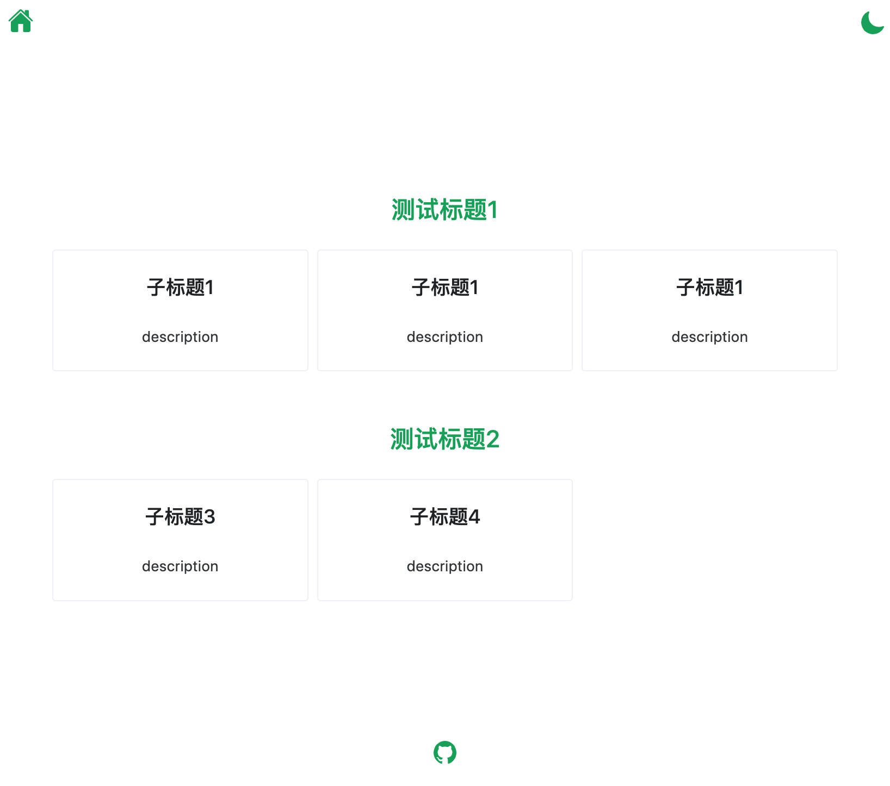
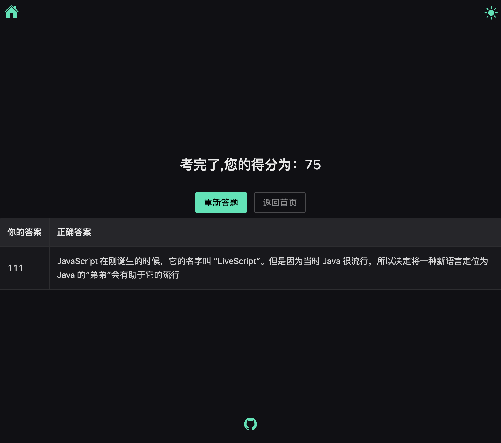

# JianCe 简测

JianCe是一个简简单单的学习结果检测的小工具，通过设置一组在线试题（题型包括：单选、多选、判断、简答）来检验学习结果。


界面预览：


准备答题


暗黑主题


答题结果、评分，错题展示。



### 安装依赖

```sh
npm install
```

### 启动

```sh
npm run dev
```

### 编译打包

```sh
npm run build
```
