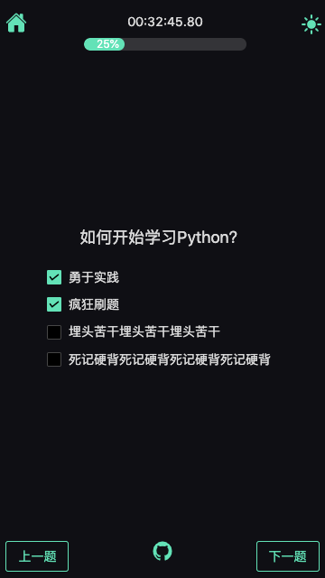
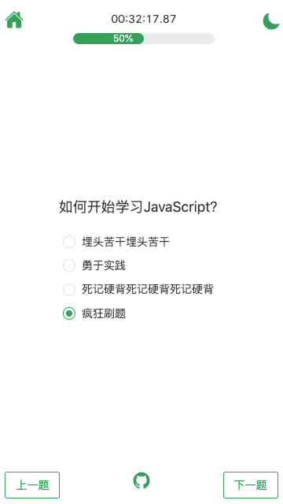
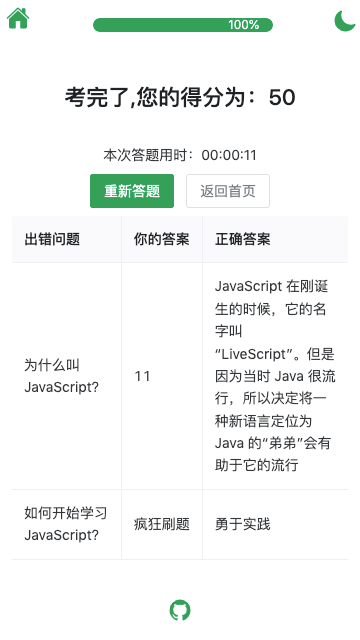

# JianCe 简测

检验学习成果，简单测试一下。


JianCe是一个简简单单的学习结果检测的小工具，通过设置一组在线试题（题型包括：单选、多选、判断、简答）来检验学习结果。


### 功能

- [x] 答题开始组件
- [x] 答题结束组件
- [x] 加载题库是先把题库随机打乱
- [x] 添加答题进度
- [x] 答题首页显示题目数量
- [x] 得分页面显示错题的时候问题和答案同时显示。
- [x] 添加ctrl+enter 进行下一道题
- [x] 把答题页面继续组件化
- [x] 答题的时间控制，倒计时展示
- [x] 显示每一道题的类型
- [ ] 加载失败或题库不存在的时候进行提示。
- [ ] 在答题页面时，如果要返回首页，应该提示是否要放弃答题而返回首页？
- [ ] 控制问题标题的文字大小

演示页面：bosichong.github.io

界面预览：


准备答题




亮色主题随心切换，答题结果、评分，错题展示。






### 安装依赖

项目依赖很简单：

    "dependencies": {
    "axios": "^1.3.4",
    "pinia": "^2.0.33",
    "vue": "^3.2.47",
    "vue-router": "^4.1.6"
    },

终端进入项目的根目录，先安装项目的依赖：

```sh
npm install
```

### 启动

```sh
npm run dev
```

### 编译打包

```sh
npm run build
```

### 添加和编辑题库

题库的编写使用json文件。

`public/data`  为题库及目录文件存放目录

`public/data/navigation.json` 题库目录，这里索引了所有的测试题连接

`public/data/test.json`  是一组测试题

目录json编辑很简答了，看下json的结构就可以了解了。

测试题目前有四种，下边是一组测试题的案例：

    {
    "title": "题库的标题",
    "description": "题库的描述题库的描述题库的描述",
    "questions": [
            {
            "type": "单选题",
            "question": "如何开始学习JavaScript？",
            "options": ["死记硬背","疯狂刷题","勇于实践","埋头苦干"],
            "answer": "勇于实践"
            },
            {
            "type": "多选题",
            "question": "如何开始学习Python？",
            "options": ["死记硬背","疯狂刷题","勇于实践","埋头苦干"],
            "answer": ["疯狂刷题","勇于实践"]
            },
            {
            "type": "判断题",
            "question": "JavaScript是世界上最好的编程语言？",
            "answer": "错误"
            },
            {
            "type": "简答题",
            "question": "为什么叫JavaScript？",
            "answer": "JavaScript 在刚诞生的时候，它的名字叫 “LiveScript”。但是因为当时 Java 很流行，所以决定将一种新语言定位为 Java 的“弟弟”会有助于它的流行"
            }
        ]
    }


### 写在最后

JianCe检测 是我为了测试孩子学习情况所编写的小玩意，当然也可以用来检测其他任何类型知识的学习结果的。希望大家喜欢，欢迎提交代码。